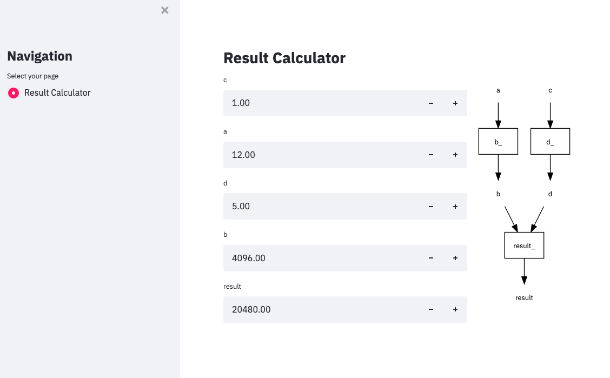

# dagapp
Making apps from DAGs by just snapping your fingers

To install:	```pip install dagapp```

[What's a DAG?](https://en.wikipedia.org/wiki/Directed_acyclic_graph)

[What's an app?](https://www.amazon.com/Life-Real-Dummies-Clueless-1996-10-03/dp/B01F81N4D0)

Enough theory. Here's how it works...

### First make a DAG

```python
from meshed.dag import DAG

def b(a):
    return 2 ** a


def d(c):
    return 10 - (5 ** c)


def result(b, d):
    return b * d
    
dag = DAG((b, d, result))
```

### Then make an app

```python
from dagapp.base import dag_app
from functools import partial

dags = [dag]

if __name__ == "__main__":
    app = partial(dag_app, dags=dags)
    app()
```

### Then run the app

```
>>> streamlit run example.py
```

### ... and this is what you get




